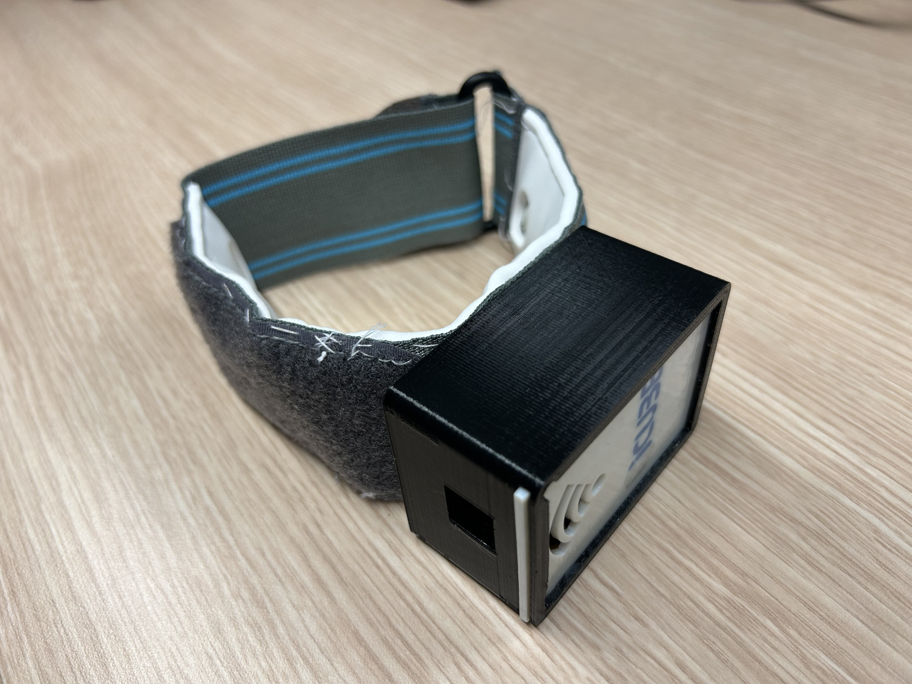
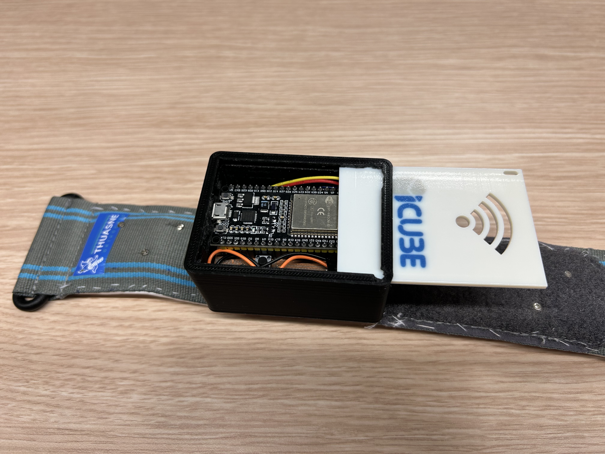
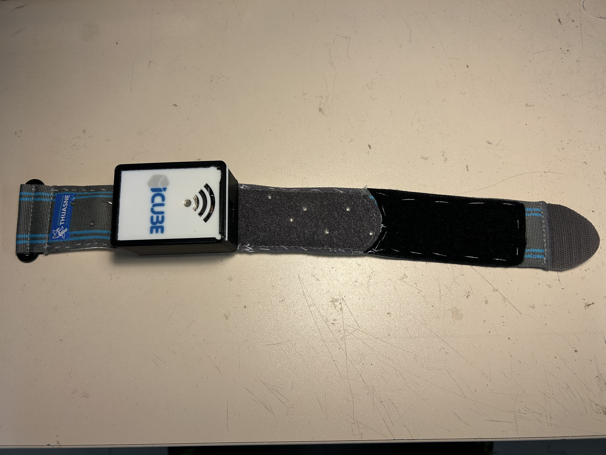
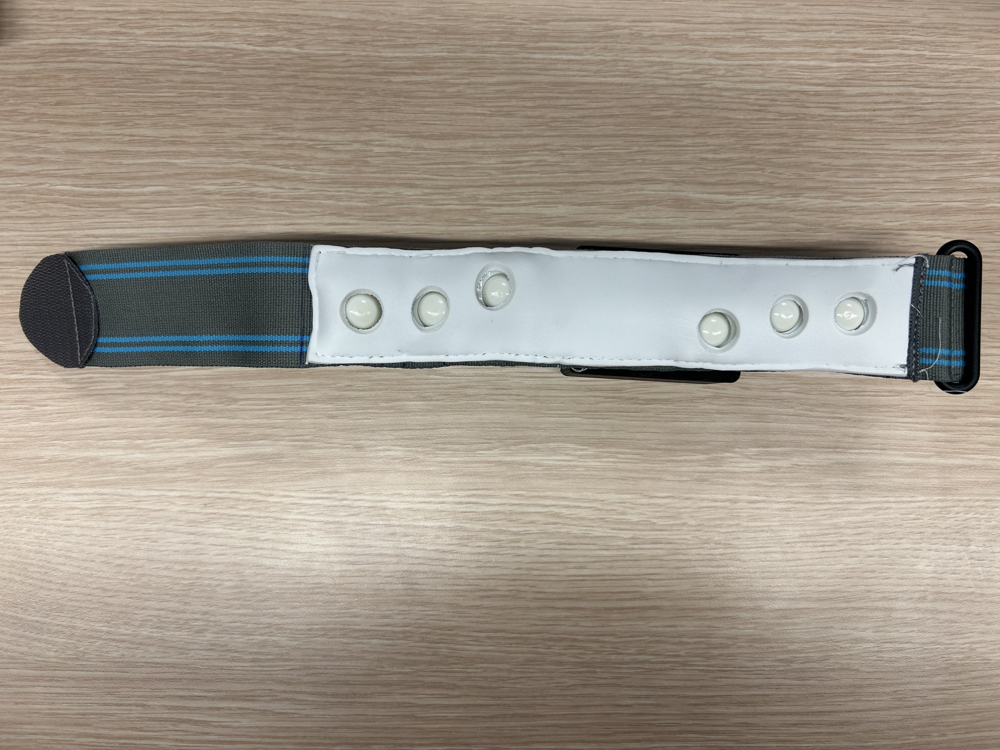

<!-- Improved compatibility of back to top link: See: https://github.com/othneildrew/Best-README-Template/pull/73 -->

<!--
*** Thanks for checking out the Best-README-Template. If you have a suggestion
*** that would make this better, please fork the repo and create a pull request
*** or simply open an issue with the tag "enhancement".
*** Don't forget to give the project a star!
*** Thanks again! Now go create something AMAZING! :D
-->

<!-- PROJECT SHIELDS -->
<!--
*** I'm using markdown "reference style" links for readability.
*** Reference links are enclosed in brackets [ ] instead of parentheses ( ).
*** See the bottom of this document for the declaration of the reference variables
*** for contributors-url, forks-url, etc. This is an optional, concise syntax you may use.
*** https://www.markdownguide.org/basic-syntax/#reference-style-links
-->
[![LinkedIn][linkedin-shield]][linkedin-url]

<!-- PROJECT LOGO -->
 

  

  <h1 align="center">Low-Cost Force Sensing System Prototyping for Upper-Limb Rehabilitation</h1>

  

    <a href="https://github.com/Jesse-Alves?tab=repositories"><strong>View all repositories  »</strong></a>
     
     
  

<!-- TABLE OF CONTENTS -->

  
Table of Contents

  <ol>
    <li>
      <a href="#about-the-project">About The Project</a>
      <ul>
        <li><a href="#built-with">Built With</a></li>
      </ul>
    </li>
    <li>
      <a href="#getting-started">Getting Started</a>
      <ul>
        <li><a href="#prerequisites">Prerequisites</a></li>
<!--         <li><a href="#installation">Installation</a></li> -->
      </ul>
    </li>
    <li><a href="#usage">Usage</a></li>
<!--     <li><a href="#roadmap">Roadmap</a></li>
    <li><a href="#contributing">Contributing</a></li>
    <li><a href="#license">License</a></li> -->
    <li><a href="#contact">Contact</a></li>
<!--     <li><a href="#acknowledgments">Acknowledgments</a></li> -->
  </ol>

<!-- ABOUT THE PROJECT -->
## About The Project

Currently, robotics-assisted devices, such as exoskeleton and collaborative robotic arms, have been used for rehabilitation therapy. Where one of the biggest causes of the physical disability is stroke. However, despite the high benefits and potential of using these devices, the clinical application remains limited due mainly to the complexity and the high cost. Therefore, different strategies are used to overcome these limitations, such as the use of alternatives sensors and materials. In this context, this article presents the prototyping of a low cost and compact bracelet to detect the upper arm contraction using Force Sensing Resistor (FSR) and then, send the data from a cheap microcontroller to Robot Operating System (ROS2) environment.

Keywords: Rehabilitation, Post-Stroke, Robotic, FSR, Low-Cost.

[(Full article)](https://github.com/Jesse-Alves/Low-Cost-Force-Sensing-System-Prototyping-for-Upper-Limb-Rehabilitation/blob/main/Low-Cost%20Force%20Sensing%20System%20Prototyping%20for%20for%20Upper-Limb%20Rehabilitation.pdf)

[(Full Test Video)](https://1drv.ms/v/s!Ah6ATMOdK-3mgutUfqPUrB_IlDdTVw?e=WdsoXN)

    

### The Prototype

  

  

(<a href="#readme-top">back to top</a>)

### Built With
*  
*  
* 
* 
* 
* 
* 
* 
* 

(<a href="#readme-top">back to top</a>)

<!-- GETTING STARTED -->
## Getting Started

This is medical device prototyping designed using microcontrollers, PCB manufacturing, CAD models and ROS2 environment.

### Prerequisites

All this project was built in ROS2 Humble environment, using ROS2 Control, ESP32 microcontroller, Arduino IDE and CREO PTC CAD software.

<!-- USAGE EXAMPLES -->
## Usage

All the codes and CAD designs of the project are available in the repository.

The written [Article](https://github.com/Jesse-Alves/Low-Cost-Force-Sensing-System-Prototyping-for-Upper-Limb-Rehabilitation/blob/main/Low-Cost%20Force%20Sensing%20System%20Prototyping%20for%20for%20Upper-Limb%20Rehabilitation.pdf) has two appendices, one explains step by step how to reproduce the prototype and the second how to use the device.

(<a href="#readme-top">back to top</a>)

<!-- CONTACT -->
## Contact

Jessé de Oliveira Santana Alves - [Linkedin - jessealves11](https://linkedin.com/in/jessealves11) - jessalves2@gmail.com

(<a href="#readme-top">back to top</a>)

<!-- MARKDOWN LINKS & IMAGES -->
[linkedin-shield]: https://img.shields.io/badge/-LinkedIn-black.svg?style=for-the-badge&logo=linkedin&colorB=555
[linkedin-url]: https://linkedin.com/in/jessealves11
